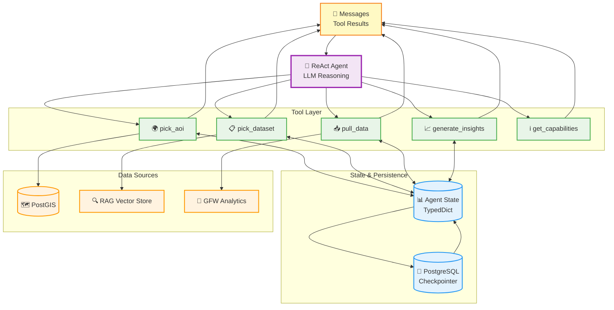

# Project Zeno LLM Agent Architecture

## Overview

Project Zeno is a ReAct (Reasoning and Acting) agent built with LangGraph that provides language interface to geospatial data. The agent follows a simple sequential tool-calling pattern to transform user queries into data insights and visualizations.

## System Architecture Overview



## Architecture Components

### 1. Agent Framework
- **Framework**: LangGraph with ReAct pattern
- **Model**: Configurable LLM (Gemini, Claude Sonnet, GPT-4, etc.)
- **State Management**: Persistent conversation state with PostgreSQL checkpointing
- **Tool Execution**: Sequential, one-at-a-time tool calling (no parallel execution)

### 2. Agent State Schema

The agent maintains state throughout the conversation using the `AgentState` TypedDict:

```python
class AgentState(TypedDict):
    messages: Annotated[Sequence[BaseMessage], add_messages]
    user_persona: str

    # AOI Selection State
    aoi: dict                    # Selected area of interest
    subregion_aois: dict        # Sub-regions within AOI
    subregion: str              # Type of subregion
    aoi_name: str               # Human-readable AOI name
    subtype: str                # AOI classification
    aoi_options: list[dict]     # All AOI selections made

    # Dataset Selection State
    dataset: dict               # Selected dataset metadata

    # Data Retrieval State
    raw_data: dict              # Retrieved data by AOI/dataset
    start_date: str             # Query start date
    end_date: str               # Query end date

    # Insight Generation State
    insights: list              # Generated insights
    charts_data: list           # Chart configurations
    insight_count: int          # Number of insights created
```

### 3. Core Tools

The agent has access to 5 specialized tools that execute sequentially:

#### 3.1 `pick_aoi` - Area of Interest Selection
- **Purpose**: Identifies and selects geographic areas based on user queries
- **Data Sources**: PostGIS database with multiple geometry tables
- **Capabilities**:
  - Fuzzy text matching using PostgreSQL trigram similarity
  - Multi-source search (GADM, KBA, WDPA, Landmarks, Custom areas)
  - LLM-based disambiguation for multiple matches
  - Subregion filtering (countries, states, districts, municipalities, etc.)
  - Translation support for non-English place names

#### 3.2 `pick_dataset` - Dataset Selection via RAG
- **Purpose**: Selects the most relevant environmental dataset for user queries
- **Method**: Retrieval-Augmented Generation (RAG) with OpenAI embeddings
- **Process**:
  1. Vector similarity search against dataset documentation
  2. LLM evaluation of candidate datasets
  3. Context layer selection within datasets
  4. Date range validation and warnings

#### 3.3 `pull_data` - Data Retrieval
- **Purpose**: Fetches actual data from analytics APIs
- **Architecture**: Strategy pattern with pluggable data handlers
- **Handlers**:
  - `AnalyticsHandler`: GFW Analytics API integration
  - Extensible for additional data sources
- **Features**:
  - Multi-AOI data pulling
  - Caching to avoid duplicate requests
  - Error handling and validation

#### 3.4 `generate_insights` - Data Analysis & Visualization
- **Purpose**: Transforms raw data into insights and chart configurations
- **Process**:
  1. Data preprocessing and CSV conversion
  2. LLM analysis with dataset-specific guidelines
  3. Chart.js-compatible output generation
  4. Follow-up suggestion generation
- **Chart Types**: Line, bar, stacked-bar, pie, area, scatter, table
- **Output**: Recharts-compatible JSON for frontend rendering

#### 3.5 `get_capabilities` - Self-Description
- **Purpose**: Provides information about agent capabilities and available datasets
- **Use Case**: Prevents hallucination when users ask "what can you do?"
- **Content**: Dynamically loaded from dataset configuration files

## Workflow Patterns

### Standard Query Flow
```
User Query → pick_aoi → pick_dataset → pull_data → generate_insights → Response
```

### Multi-AOI Comparison Flow
```
User Query → pick_aoi (AOI 1) → pick_aoi (AOI 2) → pick_dataset → pull_data → generate_insights → Response
```

### UI Integration Flow
```
UI Selection → Agent Acknowledgment → Missing Component Tools → generate_insights → Response
```

## Key Design Principles

### 1. Sequential Tool Execution
- Tools execute one at a time to ensure proper state management
- Each tool waits for completion before the next begins
- Prevents race conditions and ensures data consistency

### 2. State-Driven Architecture
- All tools read from and update the shared `AgentState`
- State persists across conversation turns via PostgreSQL checkpointing
- Enables multi-turn conversations and context retention

### 3. Modular Data Handling
- Strategy pattern allows easy addition of new data sources
- Each handler implements the `DataSourceHandler` interface
- Clean separation between data retrieval and processing logic

### 4. LLM-Guided Decision Making
- Natural language understanding for geographic disambiguation
- Intelligent dataset selection based on query context
- Automated insight generation with domain expertise

## External APIs
- **GFW Analytics API**: Primary data source for environmental datasets
- **PostGIS Database**: Geometry storage and spatial queries
- **OpenAI Embeddings**: RAG-based dataset selection
- **LLM APIs**: Multiple model support (Gemini, Claude, GPT-4)

## Extensibility

### Adding New Tools
1. Implement tool function with `@tool` decorator
2. Add to `tools` list in `agents.py`
3. Update `AgentState` schema if needed
4. Add tool documentation to agent prompt

### Adding New Data Sources
1. Create handler class implementing `DataSourceHandler`
2. Register handler in `DataPullOrchestrator`
3. Add dataset metadata to configuration files
4. Update RAG embeddings if needed

### Adding New Chart Types
1. Extend `ChartInsight` model with new chart type
2. Update chart selection logic in `generate_insights`
3. Add frontend rendering support
4. Update documentation and examples

This architecture provides a robust, extensible foundation for natural language geospatial data analysis while maintaining clear separation of concerns and enabling easy maintenance and enhancement.
