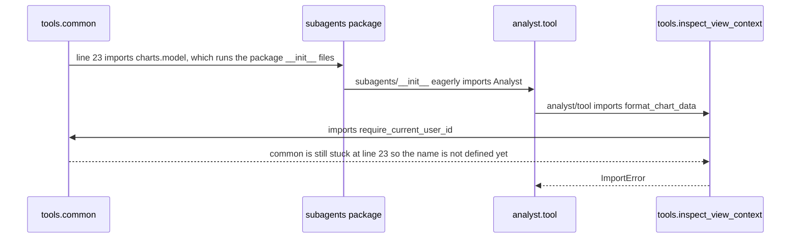
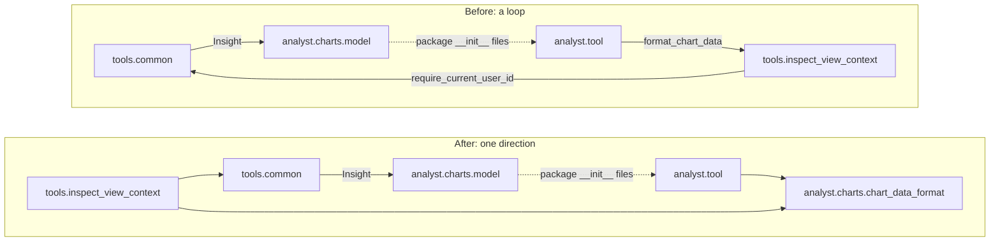

# ADR 0002: No import cycles between agent tools and subagents

**Status:** Accepted, 2026-10-02
**Scope:** module-level imports in `src/agent/tools` and `src/agent/subagents`, guarded by `tests/architecture/test_import_cycles.py`.

## Context

Importing `src.agent.tools.common` on its own failed:

```
ImportError: cannot import name 'require_current_user_id' from partially initialized module 'src.agent.tools.common' (most likely due to a circular import)
```

11 of the 19 modules in `src/agent/tools` had the same problem. Nobody noticed, because the app and the root `tests/conftest.py` happen to import things in an order that works. A cycle like this does harm in two places.

**App loading.** Whether the app starts depends on which module gets imported first. Anything that changes that order can make startup fail with an `ImportError`:

- a new entry point, such as a CLI command, a worker or a script;
- a lazy import;
- import sorting (`ruff` reorders imports on every commit);
- deleting an import that looked unused.

The error also points at the wrong place. It names a function that clearly exists, in a module that's only partly loaded.

**Our workflow.**

- **Every test run pays for the whole app.** Unit tests only worked because the root conftest imports `src.api.app` first, and that one import takes 10.2 s. Running a single file of 54 tests took 12–20 s, of which 0.2–0.6 s was tests.
- **The way to skip that cost was blocked.** Running with `--confcutdir=tests/unit` stopped at collection with the error above.
- **It caught us during TDD.** A collection error stops the whole pytest session, so one bad import hides every other result.

### How the cycle worked

When Python imports a module, it registers the module in `sys.modules` before running its body. If the body leads back to that module, the second import gets a module that's only partly filled in:



The loop exists because each package depends on the other:



## Decision

1. **Chart formatting belongs to the charts package.** `format_chart_data`, `format_numeric_stats` and their `DATA_*` limits moved unchanged from `tools/inspect_view_context.py` to `subagents/analyst/charts/chart_data_format.py`. This follows the direction tools already used: three tools import `analyst.charts.*`, and with this change no subagent imports `inspect_view_context` anymore.
2. **A fitness function keeps it that way.** `test_agent_tool_modules_import_in_a_fresh_interpreter` imports each tool module from scratch and asserts that none of them fails.

## How the fitness function prevents this

The test starts one Python subprocess. Before importing each module in `src/agent/tools`, the subprocess removes every `src.*` entry from `sys.modules`. So each module goes first, the way it would for a brand-new entry point. Third-party packages stay loaded between modules, because a cycle depends only on our own imports.

- **It fails as it should.** Before the fix it reported all 11 broken modules. It also failed when the fix was reverted, and when just the old import was put back into `analyst/tool.py`.
- **It doesn't depend on import order.** A test that runs inside pytest can't catch these cycles, because pytest has already imported half the app. That's why this one bypasses pytest's imports.
- **The failure names every broken module and its error,** not only the first one hit.
- **Cost:** 15–16 s on a laptop that was moderately busy at the time (load average about 8). That's fine before a commit or in CI, but too slow for the inner TDD loop.

## Alternatives rejected

- **Import `Insight` only for type checking in `common.py`:** a two-line fix, but the subagent would still depend on a tool module. The cycle would come back the first time `common` needs a chart model at runtime.
- **Remove the eager imports from the `subagents` package `__init__` files:** that changes the public import paths (`from src.agent.subagents import Analyst`) and touches far more code than this fix needs.
- **A static check of the import graph (AST):** it would take milliseconds, but it treats imports inside functions and type-checking-only imports the same as real ones, so it would flag cycles that never happen at runtime.

## Consequences

- Unit tests no longer need the root conftest, so `pytest tests/unit --confcutdir=tests/unit` works. The speed-up hasn't been measured on an idle machine yet.
- `tests/architecture` doesn't run in CI yet (`.github/workflows/unit-tests.yml:62`), so until it does, this guard only runs locally.
- The check covers `src/agent/tools` as entry points. A cycle that can only be entered from somewhere else isn't caught yet; extend the list of modules when that happens.
- `analyst/tool.py` still imports two tool modules (`send_nudge` and `pull_data`). Neither imports `tools.common`, so they don't close a cycle today, and the fitness function will fail if that changes.
