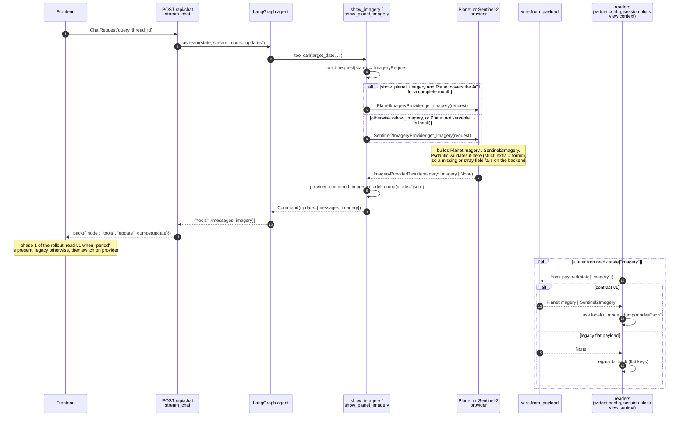

# Imagery wire contract: `/api/chat` sequence

Where contract imagery is built, validated, serialized and read. Classes: [class-diagram.md](class-diagram.md). Why: [ADR 0001](../adr/0001-imagery-wire-contract.md).

## Notes

- **One writer.** `provider_command` (`src/agent/tools/show_imagery.py:48`) is the only code that puts imagery into the state update. JSON mode matters, because langchain `dumps` turns a `date` into a `"not_implemented"` placeholder.
- **Validation happens when the model is built, not when it's dumped.** Every provider builds a strict contract model, and `provider_command` just serializes it.
- **Readers try the contract first.** `from_payload` returns `None` for legacy payloads, which still arrive from replayed checkpoints and older widget configs. Phase 3 of the rollout converts legacy on read, and the fallbacks go away in phase 5.
- **Not yet done:** `DashboardWidgetCreateRequest.validate_map_config` (`src/api/schemas.py:724`) checks only `tile_url`, not the contract.
- **Payload reference for the frontend:** [wire-contract-schema.md](wire-contract-schema.md). **Deploy order:** [rollout-plan.md](rollout-plan.md).
