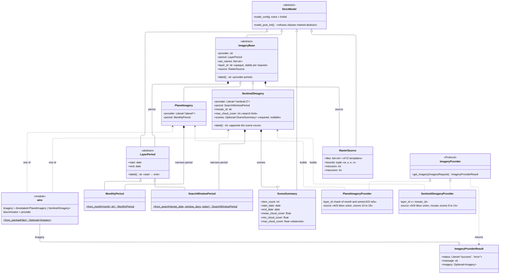

# Imagery wire contract: classes

The backend model behind the `imagery` value in `/api/chat` tool updates and in dashboard map-widget configs. Why it's shaped this way: [ADR 0001](../adr/0001-imagery-wire-contract.md). Payload reference for readers: [wire-contract-schema.md](wire-contract-schema.md).

## Modules

| module | holds | may be imported by |
|---|---|---|
| `src/shared/imagery/contract.py` | `StrictModel`, `LayerPeriod`, `RasterSource`, `ImageryBase` | anyone |
| `src/shared/imagery/wire.py` | `Imagery`, `from_payload` | anyone. **This is what consumers depend on** |
| `src/shared/imagery/planet.py` | `MonthlyPeriod`, `PlanetImagery` | `wire` and `src/agent/imagery/planet.py` only |
| `src/shared/imagery/sentinel2.py` | `SearchWindowPeriod`, `SceneSummary`, `Sentinel2Imagery` | `wire` and `src/agent/imagery/sentinel2.py` only |

The import boundary in the last two rows is enforced by `tests/architecture/test_imagery_contract_boundaries.py`.

**Readers** go through `wire.from_payload`, which returns contract imagery, or `None` for a legacy payload so the caller can fall back:
- `api/services/widget_configs.imagery_config`
- `agent/middleware.format_session_block`
- `agent/tools/inspect_view_context._format_map_widget`

`api/schemas.DashboardWidgetCreateRequest` doesn't read the contract. It only checks that a map widget's layer has tiles: a `tile_url` (datasets and legacy imagery) or `source.tiles` (contract imagery).

The analysis-template builder reads `ImageryProviderResult.imagery` directly.

**Writer:** `agent/tools/show_imagery.provider_command` puts `imagery.model_dump(mode="json")` into the state update.

## Coupling (internal modules; I = Ce/(Ca+Ce), D = |A + I − 1|)

| module | Ca | Ce | I | A | D |
|---|---|---|---|---|---|
| `contract.py` | 4 | 0 | 0 | 0.67 | 0.33 |
| `wire.py` | 4 | 2 | 0.33 | 1 | 0.33 |
| `planet.py` | 2 | 1 | 0.33 | 0 | 0.67 |
| `sentinel2.py` | 2 | 1 | 0.33 | 0 | 0.67 |

`contract.py`'s Ca counts `planet`, `sentinel2` and both agent providers (which build `RasterSource`). `RasterSource` is a concrete value object, so A is 2 of 3 classes. The union has to import every specialist, so the specialists can't reach I = 1. The import boundary keeps the list of modules that depend on them as short as possible.

## Notes

- **Periods store `start`/`end`** and don't take other fields. Each factory computes them once. `from_search` clamps the end to the day of the search, and the same rule is used by `mosaic.search_window`; the two are tied together by `tests/unit/agent/imagery/test_search_window_consistency.py`.
- **`abstract: ClassVar[bool] = True`** on `LayerPeriod` and `ImageryBase` turns on `StrictModel`'s guard for that class only; subclasses can be built. The flag isn't serialized.
- **`layer_id`** is opaque and required. Sentinel-2 uses its `mosaic_id`. Planet uses the first 16 hex digits of `sha256(json([month, sorted (source, src_id) refs]))`, so the same request always gets the same id, and different areas or months get different ids.
- **`source`** is the only place a layer says how to draw itself. Both providers build `bounds` from the union of the AOI bboxes (`agent/imagery/base.aoi_bounds`). The Sentinel-2 zooms are `mosaic.MOSAIC_MINZOOM`/`MOSAIC_MAXZOOM`, the same values the mosaic is built with.
- **`scenes`** is either a complete `SceneSummary` or `None`. The provider returns `None` unless the mosaic has every scene statistic.
