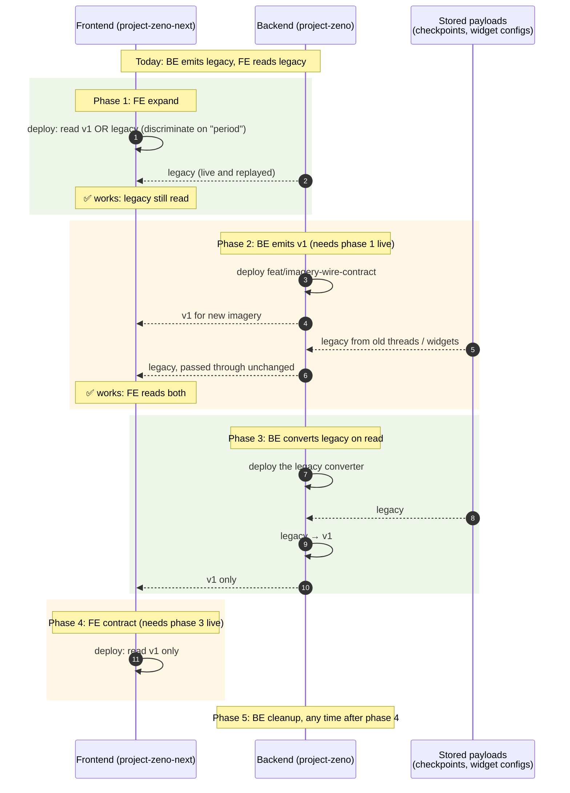

# Imagery wire contract: rollout plan

**Goal:** move `/api/chat` imagery from the legacy flat `ImageryState` shape to the imagery wire contract v1 ([wire-contract-schema.md](wire-contract-schema.md)), with **zero downtime** and **no lockstep releases** of project-zeno (backend) and project-zeno-next (frontend).

**Approach:** expand / contract. Every release has to work with the release currently deployed on the other side, and with data stored by any earlier release.

## Why there are always two shapes

- **New payloads:** the backend switches producers to v1 in phase 2.
- **Stored payloads never change on their own:**
  - thread replay (`replay_chat`) sends back checkpoint state exactly as it was written;
  - dashboard map widgets keep the `config.imagery` shape they were saved with.

  So legacy payloads have to stay readable until phase 3 converts them on read.

## Phases

| # | repo | change | depends on | ships alone because… |
|---|---|---|---|---|
| **1** | frontend | **expand**: `toImageryMeta` and `showImagery` read **both** shapes (v1 when `period` is present, otherwise legacy). Layer id from `mosaic_id`, falling back to `tile_url` (Planet has no `mosaic_id` in v1). Unknown `provider` → the layer is skipped | the v1 contract document | today's backend sends only legacy, which it still reads |
| **2** | backend | producers emit v1 (branch `feat/imagery-wire-contract`); backend readers try the contract first, then legacy (`wire.from_payload` plus the legacy fallbacks) | phase 1 **live** | the frontend reads both shapes |
| **3** | backend | **convert legacy on read**: `ImageryState` moves to `src/shared/imagery/legacy.py` as the legacy parser, with a converter to v1, applied in `replay_chat` and dashboard widget reads. The legacy tests marked strict xfail become the converter's tests | phase 2 | the frontend still reads both; now it only ever gets v1 |
| **4** | frontend | **contract**: drop reading the legacy shape | phase 3 **live** | the backend never sends legacy after phase 3 |
| **5** | backend | clean up the backend's contract-then-legacy fallbacks (the converter makes them redundant); optionally rewrite saved widget configs in a DB migration | phase 4 | only internal readers change |

The only ordering rules are **1 before 2** and **3 before 4**. Every other deploy can happen whenever it's ready.

## Deploy sequence

## Rollback table

What happens if one side is rolled back while the other stays on its current release.

> Verdicts come from **reading the code** on both sides (`main` and the branch backend; `toImageryMeta` / `showImagery.ts` in the frontend). They haven't been checked by running mixed versions. Before phase 2, a staging check of the "BE 2 → 1" row would confirm the degraded-not-broken claim.

| rolled back | other side | new payloads | stored v1 payloads (written after phase 2) | stored legacy payloads | verdict |
|---|---|---|---|---|---|
| FE 1 → 0 | BE 0/1 (legacy) | legacy ✅ | none exist yet | legacy ✅ | ✅ safe |
| FE 1 → 0 | BE 2+ (v1) | **v1 ✗**: old FE reads flat fields, Planet layer id `imagery-undefined` | ✗ | ✅ | ❌ **broken**: never roll FE back past phase 1 while BE is at phase 2+ |
| BE 2 → 1 | FE 1+ | legacy ✅ (FE reads both) | old BE reads v1 widget configs through legacy paths: summaries degrade (`around ?` / `around None`), `validate_map_config` still passes (`tile_url` present); no crash | ✅ | ⚠️ **degraded**, acceptable for a short rollback |
| BE 3 → 2 | FE 1–3 | v1 ✅ | v1 ✅ | legacy passed through ✅ (FE still reads both) | ✅ safe |
| BE 3 → 2 | FE 4 (v1 only) | v1 ✅ | v1 ✅ | **legacy ✗**: FE 4 can't read it | ❌ **broken**: don't roll BE back past phase 3 while FE is at phase 4 |
| FE 4 → 3 | BE 3+ | v1 ✅ | v1 ✅ | converted v1 ✅ | ✅ safe |
| BE 5 → 4-era | FE any | v1 ✅ | v1 ✅ | converted ✅ | ✅ safe |

**Rule:** roll back only within a phase pair. Each ❌ row has the same cause: one side's reader can't read what the other side sends.

## Status (2026-09-29)

| phase | status |
|---|---|
| 1 | not started. Contract document ready: [wire-contract-schema.md](wire-contract-schema.md) |
| 2 | built on `feat/imagery-wire-contract` (local, not pushed). **Must not merge before phase 1 is live** |
| 3 | not started. Legacy knowledge kept in strict-xfailed tests (`tests/agent/test_imagery_providers.py`) and in `src/agent/models.py` (`ImageryState`) |
| 4, 5 | not started |

## Related

- [wire-contract-schema.md](wire-contract-schema.md): the v1 contract and tolerant JSON schema.
- [class-diagram.md](class-diagram.md): the backend classes and module boundaries.
- [chat-imagery-sequence.md](chat-imagery-sequence.md): the `/api/chat` imagery flow.
- [ADR 0001](../adr/0001-imagery-wire-contract.md): why the contract is shaped this way.
- `sentinel2-cached-mosaic-period-drift-ticket.md`: Sentinel-2 `period` can overstate coverage on mosaic cache hits.
- `analysis-template-silent-widget-failures-ticket.md`.
- Open follow-ups: publish the schema from code (`json_schema_serialization_defaults_required`, snapshot test); run `tests/architecture` in CI.
