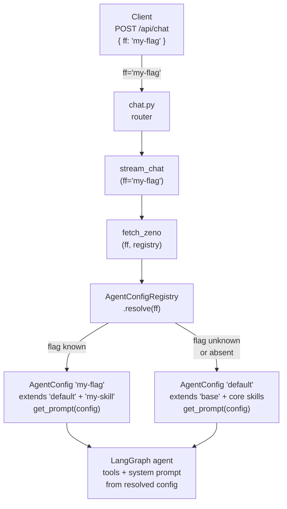

# Agent Feature Flags

Feature flags let you swap the agent's capability surface (skills, and the tools derived from them) and system prompt on a per-request basis without touching the database. A client passes `"ff": "<flag-name>"` in the `POST /api/chat` request body; the server resolves this to a named `AgentConfig` and builds the agent from it.

## The profile chain

Profiles form a chain, each one a small delta on its parent:

```
base         core toolbox (pick_aoi, pick_dataset, pull_data, generate_insights), no skills
  └─ default       base + core skills (analyze, pull-data, capabilities)
       └─ experimental  default + opt-in skills (dashboard, show-imagery, wri-insights, explore)
                        + standalone tools (inspect_view_context, update_insight_display, search_insights)
```

`base` ships as its own flag so raw tool-calling can be evaluated without recipe guidance. `default` is what unknown or absent `ff` values fall back to. Each production profile's full derived surface (skills, subagents, tools) is snapshot-tested in `tests/unit/agent/test_profile_manifest.py` — run `config.describe()` to see it, and update the snapshot when you change a profile on purpose.

## How it works



Each `AgentConfig` declares:
- **`extends`** — the parent profile whose skills and tools it inherits; the registry flattens the chain at registration time (parents must be registered first)
- **`skills`** — skill names this profile adds (files in `src/agent/skills/skills_md/`); the tools those skills require are *derived* from each skill's `requires:` frontmatter (plus `read_skill` itself), so a skill can never be declared without its tools, and adding a tool can never silently activate a skill
- **`tools`** — `ToolSpec` objects bound directly, independent of any skill: the base profile's core toolbox, or standalone tools no skill's workflow owns (e.g. `inspect_view_context`)
- **`system_prompt`** — an optional override that replaces the generated prompt entirely (useful for test personas like "say only the word cat")

A skill's `requires:` stays a complete list of what its workflow calls, even when the parent profile already binds those tools — the overlap dedupes, and the skill stays portable to profiles built on a leaner base.

Declaring an unknown skill name, a skill whose `requires:` names a tool missing from `ALL_SPECS`, or an `extends` naming an unregistered profile raises at registration time. The system prompt is always `config.system_prompt or get_prompt(config)`. `get_prompt` renders the tools and skills sections from the config automatically, so the prompt can never describe a skill or tool that isn't bound.

## Adding a new feature flag

### 1. Implement the tool and define its `SPEC`

In your tool file, add a `SPEC` constant at the bottom after the tool function:

```python
# src/agent/subagents/my_tool/tool.py
from src.agent.tool_spec import ToolCategory, ToolSpec

@tool("my_tool")
async def my_tool(query: str, ...) -> Command:
    """..."""
    ...

SPEC = ToolSpec(
    tool=my_tool,
    category=ToolCategory.SUBAGENT,
    prompt_fragment="- my_tool(query): one-line description for the system prompt.",
)
```

Add the spec to `ALL_SPECS` in `agent_config.py` — its position there is its position in every profile's prompt.

### 2. Wrap it in a skill (usually) and register an `AgentConfig`

If the tool is part of a workflow, write a skill file in `src/agent/skills/skills_md/` that lists it under `requires:`, then declare the skill in a profile that extends an existing one. Use `tools` only for standalone tools:

```python
# src/agent/agent_config.py
default_registry.register(AgentConfig(
    "my-flag",
    extends=DEFAULT_PROFILE,
    skills=("my-skill",),
    tools=(my_standalone_tool_spec,),
))
```

The config's `name` is the exact string the client passes as `ff`.

### 3. Snapshot the new profile's surface

Add the profile's `describe()` output to `tests/unit/agent/test_profile_manifest.py` — the test suite fails on any registered profile without a snapshot, so the full derived surface is always visible in review.

### 4. Use the flag from a client

```json
POST /api/chat
{
  "query": "...",
  "thread_id": "...",
  "ff": "my-flag"
}
```

Unknown or absent `ff` values silently fall back to the default config — no error, no change in behaviour.

## Testing a flag

Because `AgentConfigRegistry` is injected as a dependency, tests create isolated instances without touching global state:

```python
from src.agent.agent_config import AgentConfig, AgentConfigRegistry, DEFAULT_PROFILE, DEFAULT_SKILLS
from src.agent.graph import fetch_zeno
from langgraph.checkpoint.memory import InMemorySaver

async def test_my_flag():
    registry = AgentConfigRegistry()
    registry.register(AgentConfig(DEFAULT_PROFILE, skills=DEFAULT_SKILLS))
    registry.register(AgentConfig("my-flag", extends=DEFAULT_PROFILE, skills=("my-skill",)))

    agent = await fetch_zeno(ff="my-flag", registry=registry, checkpointer=InMemorySaver())
    result = await agent.ainvoke(...)
    # assert my_tool was called, others were not
```

For a bespoke test persona with no skills or tools:

```python
registry.register(AgentConfig(
    "cat",
    system_prompt="Say only the word 'cat' in response to everything.",
))
```

See `tests/agent/test_feature_flag.py` for working examples.
