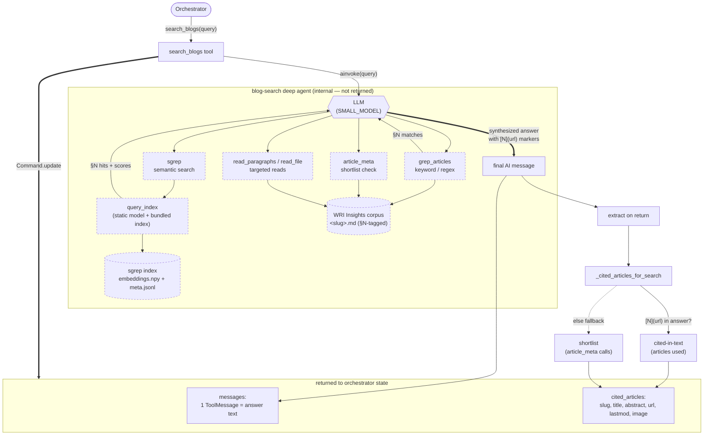

# `search_blogs` subagent flow

How the WRI Insights blog-search subagent turns a query into a cited answer,
and exactly what it hands back to the orchestrator.

## What crosses the boundary

The subagent returns a `Command` updating two pieces of orchestrator state
(`blog.py` → `search_blogs`):

- **`messages`** — a single `ToolMessage` whose content is the synthesized
  prose answer with inline `[N](url)` citation markers.
- **`cited_articles`** — article-level metadata (`slug`, `title`, `abstract`,
  `url`, `lastmod`, `image`).

The deep agent's internal tool calls (sgrep / grep / article_meta / reads) are
consumed inside `search_blogs` and **not** propagated — they live only in logs
and the Langfuse trace (dashed nodes above).

## IDs

- **Document IDs survive** — the `slug` in each `cited_articles` entry is the
  document ID, joinable to `index.json`.
- **Chunk IDs do not** — the `§N` paragraph tags are research-only and are
  stripped before the answer is returned, so the orchestrator never sees them.

## `cited_articles` semantics

`_cited_articles_for_search` prefers the **cited-in-text** set (articles whose
`[N](url)` markers appear in the answer — precision-oriented) and falls back to
the **shortlist** set (articles opened via `article_meta` — recall-oriented)
only when the answer contains no markers.

## Determinism

`query_index` / sgrep is deterministic (static embedding model, fixed index).
The end-to-end subagent output is **not** — the LLM chooses the queries,
keyword patterns, shortlist, and final synthesis, so the cited set varies run
to run.
