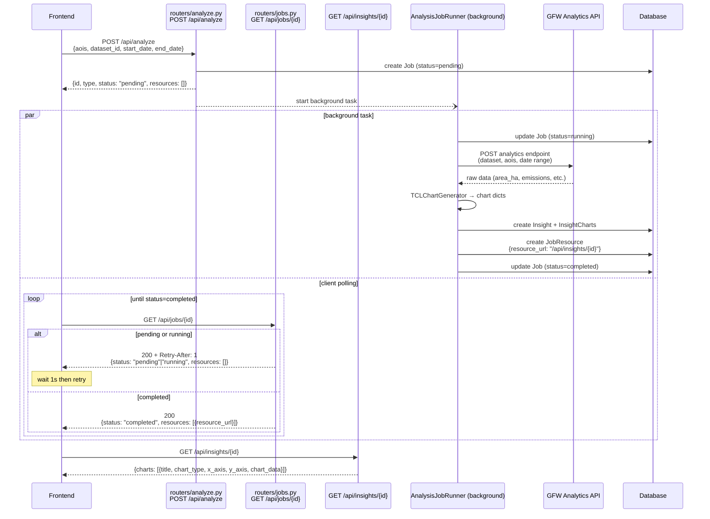

# Analyze Flow

`POST /api/analyze` returns a `Job` immediately and runs data fetching and chart
generation as a background task. The client polls `GET /api/jobs/{id}` until
the job completes, then follows `resource_url` to retrieve the results.

## Sequence



## Example

**Request**
```json
POST /api/analyze
{
  "aois": [{"source": "gadm", "src_id": "BRA", "subtype": "country"}],
  "dataset_id": 4,
  "start_date": "2020-01-01",
  "end_date": "2022-12-31"
}
```

**Immediate response** (`status: pending`)
```json
{
  "id": "3ac814f6-5065-4da2-beb5-b683c2740c02",
  "type": "analysis",
  "status": "pending",
  "thread_id": null,
  "resources": [],
  "created_at": "2026-06-08T16:21:51.777511"
}
```

**Poll response** (`status: completed`)
```json
{
  "id": "3ac814f6-5065-4da2-beb5-b683c2740c02",
  "type": "analysis",
  "status": "completed",
  "resources": [
    {
      "id": "aa774e4b-f866-4f47-976b-fd4d42dd68f7",
      "resource_url": "/api/insights/e7021a4c-21ae-440a-a847-874cca10890c",
      "status": "completed",
      "created_at": "2026-06-08T16:21:52.480180"
    }
  ]
}
```

**Follow resource_url**
```json
GET /api/insights/e7021a4c-21ae-440a-a847-874cca10890c

{
  "id": "e7021a4c-21ae-440a-a847-874cca10890c",
  "insight_text": "",
  "charts": [
    {
      "title": "Annual Tree Cover Loss",
      "chart_type": "bar",
      "x_axis": "tree_cover_loss_year",
      "y_axis": "area_ha",
      "chart_data": [
        {"tree_cover_loss_year": 2020, "area_ha": 2603663.52, ...},
        {"tree_cover_loss_year": 2021, "area_ha": 2323559.31, ...},
        {"tree_cover_loss_year": 2022, "area_ha": 2571705.05, ...}
      ]
    },
    {
      "title": "Annual GHG Emissions from Tree Cover Loss",
      "chart_type": "bar",
      "x_axis": "tree_cover_loss_year",
      "y_axis": "carbon_emissions_MgCO2e",
      "chart_data": [...]
    }
  ]
}
```
