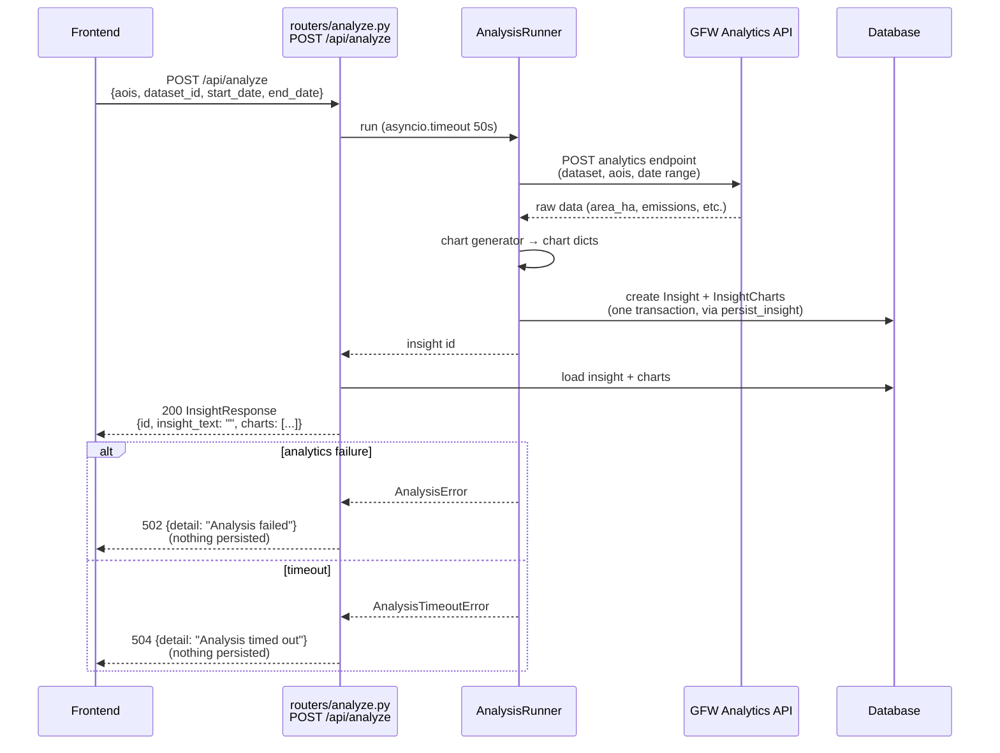

# Analyze Flow

`POST /api/analyze` runs data fetching and chart generation synchronously
inside the request and returns the generated insight — the same shape as
`GET /api/insights/{id}`. The insight and its charts are persisted in a
single transaction; a failed analysis persists nothing and surfaces as an
HTTP error (`502` when the analytics pull fails, `504` when it exceeds the
in-request time budget).

## Sequence


```mermaid
sequenceDiagram
    participant FE as Frontend
    participant Analyze as routers/analyze.py<br/>POST /api/analyze
    participant Runner as AnalysisRunner
    participant Analytics as GFW Analytics API
    participant DB as Database

    FE->>Analyze: POST /api/analyze<br/>{aois, dataset_id, start_date, end_date}
    Analyze->>Runner: run (asyncio.timeout 50s)
    Runner->>Analytics: POST analytics endpoint<br/>(dataset, aois, date range)
    Analytics-->>Runner: raw data (area_ha, emissions, etc.)
    Runner->>Runner: chart generator → chart dicts
    Runner->>DB: create Insight + InsightCharts<br/>(one transaction, via persist_insight)
    Runner-->>Analyze: insight id
    Analyze->>DB: load insight + charts
    Analyze-->>FE: 200 InsightResponse<br/>{id, insight_text: "", charts: [...]}

    alt analytics failure
        Runner-->>Analyze: AnalysisError
        Analyze-->>FE: 502 {detail: "Analysis failed"}<br/>(nothing persisted)
    else timeout
        Runner-->>Analyze: AnalysisTimeoutError
        Analyze-->>FE: 504 {detail: "Analysis timed out"}<br/>(nothing persisted)
    end
```

The insight can be re-fetched at any time via `GET /api/insights/{id}` and is
listable through `GET /api/insights` — the same read path the agent/chat flow
uses.

## Example

**Request**
```json
POST /api/analyze
{
  "aois": [{"source": "gadm", "src_id": "BRA", "subtype": "country"}],
  "dataset_id": 4,
  "start_date": "2020-01-01",
  "end_date": "2022-12-31"
}
```

**Response** (the persisted insight; `insight_text` is empty — this path
generates deterministic charts only, no LLM narrative)
```json
{
  "id": "e7021a4c-21ae-440a-a847-874cca10890c",
  "user_id": "user-123",
  "thread_id": null,
  "insight_text": "",
  "follow_up_suggestions": [],
  "charts": [
    {
      "title": "Annual Tree Cover Loss",
      "chart_type": "bar",
      "x_axis": "tree_cover_loss_year",
      "y_axis": "area_ha",
      "chart_data": [
        {"tree_cover_loss_year": 2020, "area_ha": 2603663.52, ...},
        {"tree_cover_loss_year": 2021, "area_ha": 2323559.31, ...},
        {"tree_cover_loss_year": 2022, "area_ha": 2571705.05, ...}
      ]
    },
    {
      "title": "Annual GHG Emissions from Tree Cover Loss",
      "chart_type": "bar",
      "x_axis": "tree_cover_loss_year",
      "y_axis": "carbon_emissions_MgCO2e",
      "chart_data": [...]
    }
  ],
  "is_public": false,
  "created_at": "2026-06-08T16:21:51.777511"
}
```
